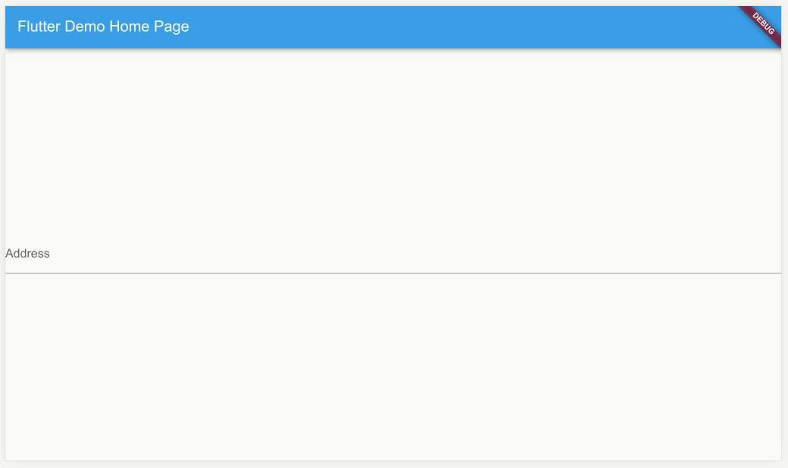

# DAWA

A Flutter widget for address input with autocomplete using Danmarks Adressers
Web API (DAWA).

> :warning: This package is in alpha. Use with caution and file any potential
issues you encounter.

## Features

Use this widget to help users find and enter correct addresses.

## Additional information

[Danmarks Adressers Web API](https://dawadocs.dataforsyningen.dk/dok/api)
